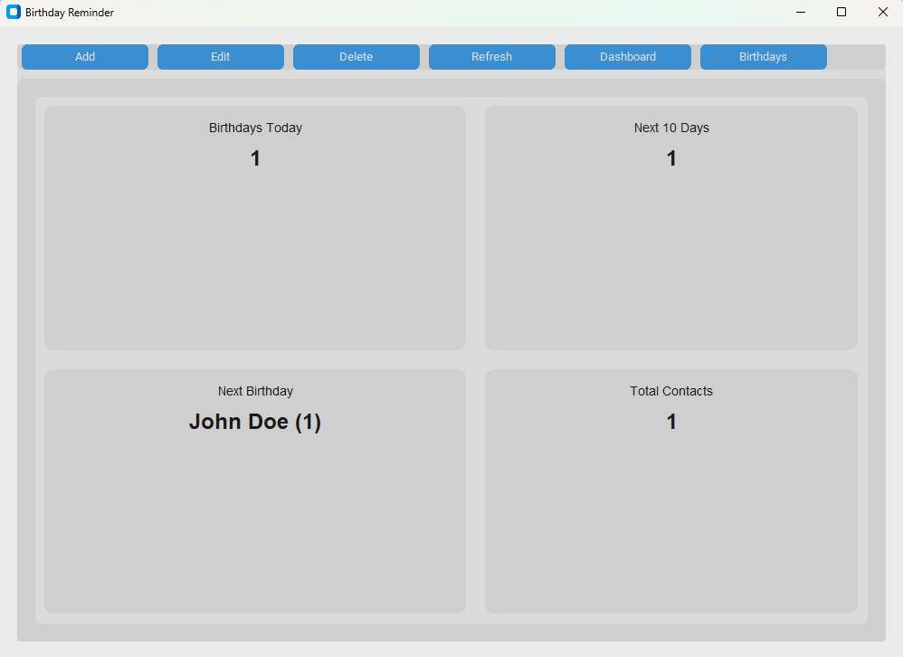

# Birthday Reminder

A simple Python desktop application that reminds you of upcoming birthdays.

## Screenshot



## Features

- Stores birthdays in a SQLite database
- Uses CustomTkinter for the graphical user interface
- Sends Windows desktop notifications for birthday alerts

## Project Structure

```
birthday_reminder/
├── main.py          # Entry point
├── database.py      # SQLite database handling
├── gui.py           # CustomTkinter GUI
├── notifications.py # Windows notification handling
├── requirements.txt # Python dependencies
└── birthday_reminder.db  # SQLite database file
```

## Getting Started

1. Clone the repository
2. Create a virtual environment
3. Install dependencies from `requirements.txt`
4. Run `python main.py`

---

*Generated with Claude Code*
